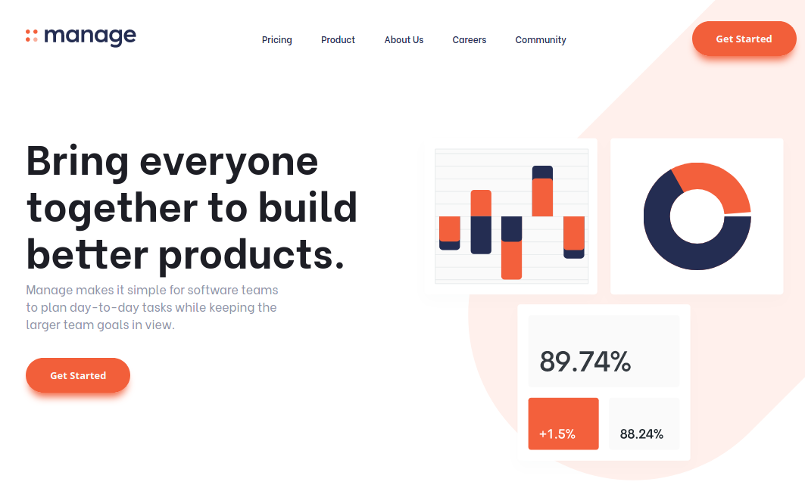

# Manage Landing Page
> [Frontend Mentor](https://www.frontendmentor.io/)'s Manage Landing Page

## Table of contents
* [General info](#general-info)
* [Screenshots](#screenshots)
* [Technologies](#technologies)
* [Learnings](#learnings)
* [Setup](#setup)
* [Features](#features)
* [Status](#status)
* [Inspiration](#inspiration)
* [Contact](#contact)

## General info
A landing page for a company called Manage

## Screenshots

## Technologies
* HTML
* SCSS
* JavaScript
* Gulp 4

## Learnings
* Mobile-first approach
* SVGs
* JavaScript slider
* Gulp

## Setup
To view this project visit the [demo](https://manage-landing-page-nicm42.now.sh/) or download the files and open index.html

## Features
* Slider

## Status
Project is: _finished_

## Inspiration
Design provided by [Frontend Mentor](https://www.frontendmentor.io/)

## Contact
Created by [nicm42](https://www.twitter.com/nicm4242) - feel free to contact me!
